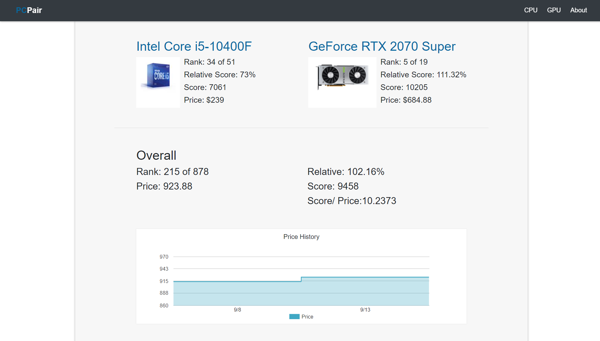

# PCPair
My hobby website for PC building.

# How to Use
*DISCLAIMER*
 
PCPair is meant to be used as a reference. Take recommendations with a grain of salt and ALWAYS watch benchmarks on real performance.
Step 1: 
